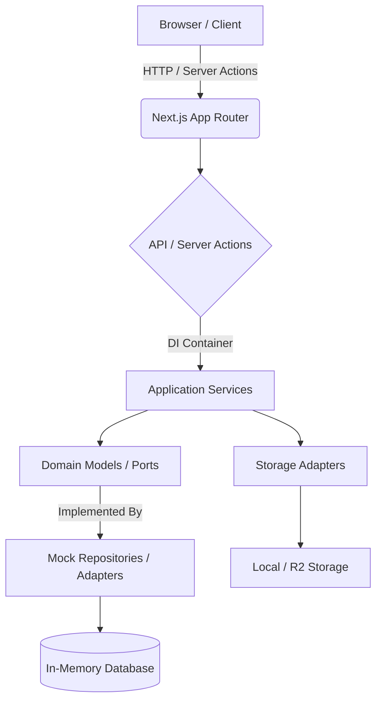
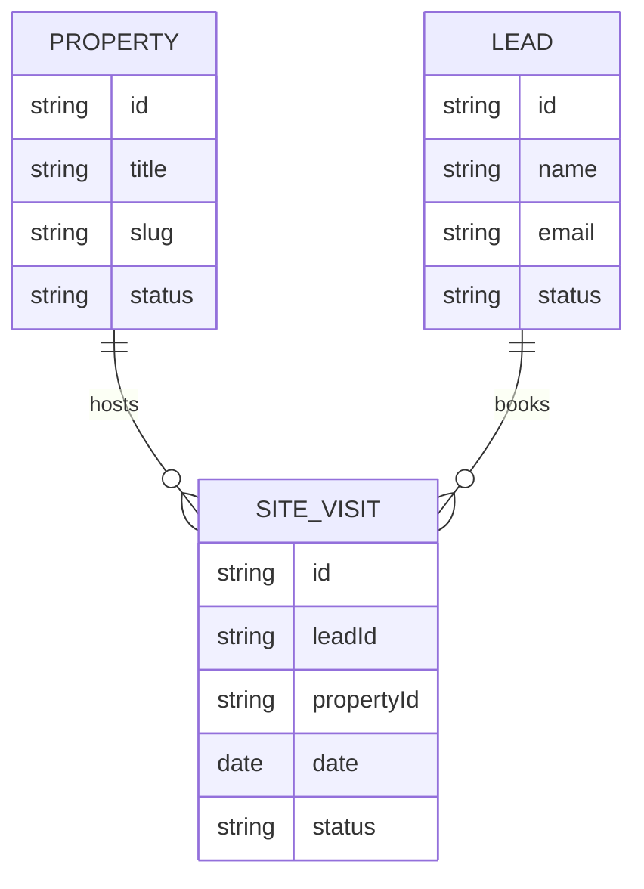
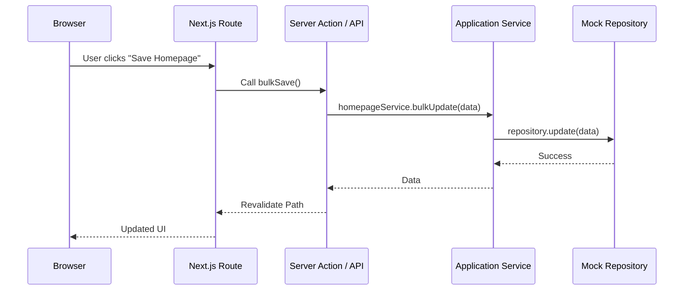

# Noble Nests Co Architecture

## 1. Project Overview
- **Purpose**: A luxury real estate platform for Noble Nests Co. Features a public-facing property showcase, a landing page, an admin CMS, and a site visit/lead management CRM.
- **Tech Stack**: Next.js 16 (App Router), React 19, TypeScript, Tailwind CSS, Shadcn UI (Radix UI), React Hook Form, Zod.
- **Current Version**: 0.1.0
- **Last Updated**: August 2026

---

## 2. High-Level Architecture

The system operates as a hybrid monolith using Next.js. The frontend and backend are tightly integrated within the Next.js application, but they are logically separated using Hexagonal Architecture (Ports and Adapters).



---

## 3. Project Folder Structure

```text
/
├── .git/                  # Version control
├── frontend/              # Main Next.js Application
│   ├── public/            # Static assets and service workers
│   ├── src/               # Application Source
│   │   ├── app/           # Next.js App Router (Pages, Layouts, API Routes)
│   │   │   ├── [brand]/   # Multi-brand dynamic routing (noblenestsco)
│   │   │   │   ├── admin/ # Admin Dashboard and CMS
│   │   │   │   ├── api/   # Next.js API Routes (Backend Endpoints)
│   │   │   │   └── properties/ # Public Property Listing and Details
│   │   ├── backend/       # Hexagonal Architecture Backend
│   │   │   ├── application/    # Services & Use Cases
│   │   │   ├── core/           # Domain Entities & Ports (Interfaces)
│   │   │   ├── di/             # Dependency Injection Container
│   │   │   ├── infrastructure/ # Persistence (Mocks), Storage Adapters
│   │   │   └── presentation/   # API Middleware and Utils
│   │   ├── components/    # Reusable UI Components
│   │   │   ├── admin/     # Admin-specific components
│   │   │   ├── features/  # Domain-specific feature components
│   │   │   ├── shared/    # Shared/Global components
│   │   │   └── ui/        # Shadcn/Radix primitive UI components
│   │   └── lib/           # Utility functions and shared config
│   ├── package.json       # Dependencies and Scripts
│   └── tailwind.config.ts # Tailwind CSS configuration
├── noblenestsco/          # Legacy or static placeholder directory
├── nginx/                 # Nginx configuration for proxy/routing
└── docker-compose.yml     # Docker orchestration for local development
```

### Folder Responsibilities
- **`frontend/src/app`**: Handles routing, SSR, page rendering, and API endpoint definitions.
- **`frontend/src/backend`**: Contains the core business logic, adhering strictly to DDD and Ports & Adapters.
- **`frontend/src/components`**: Contains React components. Separated into generic UI primitives (`ui/`) and specific features (`features/`).
- **`frontend/src/backend/di`**: Manages the instantiation and injection of repositories and services into the application layer.

---

## 4. Frontend Architecture

- **Framework**: Next.js (App Router)
- **Layouts**: Root layout for global providers and styles; brand-specific layouts; admin-specific layouts.
- **Routing**: Highly dynamic, using a `[brand]` parameter at the root to serve multiple brands (e.g., `/noblenestsco`).
- **Components**: Functional React components using hooks. Separated into Server Components (default) and Client Components (`"use client"`).
- **State Management**: React `useState`/`useContext`, supplemented by local state in forms and URL Search Params.
- **Hooks**: Standard React hooks, `react-hook-form` for forms.
- **API Layer**: Utilizes Next.js Server Actions for mutations (e.g., admin updates) and native `fetch` / direct service calls for server-side data fetching.
- **Forms & Validation**: `react-hook-form` paired with `zod` for robust schema validation.
- **UI Library**: Tailwind CSS with Shadcn UI (Radix UI primitives).
- **Theme**: Configured via Tailwind and generic CSS variables in `globals.css`.

### Routing Diagram
```mermaid
graph LR
    A[/] --> B(Landing Page - Verse by Sree)
    A --> C[/[brand]]
    C --> D(/noblenestsco)
    D --> E(/properties)
    D --> F(/properties/:slug)
    D --> G(/admin)
    G --> H(/admin/properties)
    G --> I(/admin/homepage)
    G --> J(/admin/crm)
```

---

## 5. Backend Architecture

**Type**: Next.js API (Hybrid Monolith)

**Why**: To leverage Next.js's native Server Actions and API routes, reducing operational overhead by deploying a single Node.js artifact. It allows seamless sharing of TypeScript interfaces between the frontend and backend.

**Structure (Hexagonal / Ports & Adapters)**:
- **Domain Models (`core/domain`)**: Pure TypeScript interfaces representing business entities (Property, Lead, SiteVisit, HomepageSection).
- **Ports (`core/ports`)**: Repository interfaces defining how data is accessed, agnostic of the actual database.
- **Services (`application/services`)**: Business logic orchestrators. They depend on Ports, not actual database implementations.
- **Adapters (`infrastructure/persistence`)**: Currently utilizing `mock-repositories.ts` (in-memory data arrays) to implement the Ports.
- **Dependency Injection (`di/container.ts`)**: Wires up the concrete Mock Repositories to the Application Services.

---

## 6. API Documentation

Currently implemented endpoints in `frontend/src/app/[brand]/api/`:

### `/api/properties`
- **Method**: GET
- **Purpose**: Retrieve a list of all properties.
- **Request**: Query params (e.g., city, type).
- **Response**: Array of `Property` objects.
- **Authentication**: None (Public).

### `/api/properties/[slug]`
- **Method**: GET
- **Purpose**: Retrieve a specific property by slug.
- **Request**: Slug parameter.
- **Response**: `Property` object.
- **Authentication**: None (Public).

### `/api/leads`
- **Method**: GET, POST
- **Purpose**: GET all leads (Admin) / POST a new lead.
- **Request**: `Lead` object payload (POST).
- **Response**: Array of `Lead` or created `Lead`.
- **Authentication**: Admin required for GET.

### `/api/homepage`
- **Method**: GET, POST
- **Purpose**: Retrieve homepage sections / bulk update sections.
- **Request**: Array of `HomepageSection` (POST).
- **Response**: Array of `HomepageSection`.
- **Authentication**: Admin required for POST.

### `/api/testimonials`
- **Method**: GET, POST
- **Purpose**: Manage testimonials.
- **Response**: Array of `Testimonial`.
- **Authentication**: Admin required for POST.

### `/api/settings/*` (contact, social)
- **Method**: GET, POST
- **Purpose**: Fetch and update global settings and social links.
- **Authentication**: Admin required for POST.

---

## 7. Database

**Current State**: In-memory Mock Database (`mock-repositories.ts`). 
*The following outlines the logical tables defined by the Domain interfaces.*

### Entities / Tables

1. **Property**
   - **Purpose**: Core real estate listing.
   - **Primary Key**: `id`
   - **Indexes**: `slug`, `city`
   - **Relationships**: 1:N with `PropertyImage`.

2. **Lead**
   - **Purpose**: Potential buyers/investors.
   - **Primary Key**: `id`
   - **Relationships**: 1:N with `SiteVisit`.

3. **SiteVisit**
   - **Purpose**: Scheduled property viewings.
   - **Primary Key**: `id`
   - **Foreign Keys**: `leadId`, `propertyId`

4. **HomepageSection**
   - **Purpose**: CMS sections for the dynamic homepage.
   - **Primary Key**: `id`

5. **Testimonial**
   - **Purpose**: User reviews.
   - **Primary Key**: `id`

6. **SocialLink & ContactSetting**
   - **Purpose**: Global settings configuration.
   - **Primary Key**: `id`



---

## 8. Business Modules

- **Properties**: Listing, showcasing, filtering, and admin CRUD for real estate inventory.
- **Leads & CRM**: Capture and tracking of potential clients and their pipeline status.
- **Site Visits (Bookings)**: Scheduling system linking leads to specific properties.
- **Homepage CMS**: Dynamic content manager allowing admins to add/remove/reorder sections.
- **Testimonials**: Admin curation of client reviews displayed publicly.
- **Settings & Social Media**: Global configuration for contact info and social links.
- **Admin Dashboard**: Central hub for managing the platform.

---

## 9. Dependency Injection

- **Container**: Located at `src/backend/di/container.ts`. It acts as a lightweight Service Locator/Registry.
- **Services**: Classes like `PropertyService`, `CRMService` are instantiated here.
- **Repositories**: Mock repositories (`MockPropertyRepository`, etc.) are injected into the Services.
- **Lifecycle**: Services and Repositories are instantiated as singletons on server start.

---

## 10. Request Lifecycle



---

## 11. Authentication

- **Current State**: Placeholder/Basic. Admin routes are grouped under `/admin` but currently lack robust middleware blocking (JWT implementation is pending).
- **Future Architecture**: Expected to use JWT-based sessions (likely via NextAuth/Auth.js), role-based access control (RBAC), and Edge Middleware for route protection.

---

## 12. Configuration

- **Environment Variables**: Expected in `.env.local`.
- **Feature Flags**: Currently hardcoded or managed via Settings module.
- **Configuration Loading**: Centralized `lib/config.ts` and `lib/config/brands.ts` for multi-brand URL configuration.

---

## 13. File Storage

- **Images & Media**: Currently mapped in domain interfaces.
- **Storage Adapters**: 
  - `local-storage.ts`: For local filesystem storage.
  - `r2-storage.ts`: Scaffolding exists for future Cloudflare R2 integration for production assets.

---

## 14. Testing

- **Unit Tests**: Powered by Vitest (`*.test.ts`). Focus on Application Services (`property-service.test.ts`, `api/leads/route.test.ts`).
- **Build**: Next.js production build `next build`.
- **Lint**: ESLint configured with strict TypeScript rules.
- **TypeScript**: `tsc --noEmit` used for strict type-checking across the repository.

---

## 15. Deployment

- **Current Local Setup**: Node v20 via `npm run dev`. Docker Compose available for local orchestration (`docker-compose.yml` with Nginx).
- **Future Production**: 
  - **Hosting**: Cloudflare / Vercel / Docker (TBD).
  - **Database**: Relational Database (PostgreSQL) replacing the in-memory mock repositories.
  - **Storage**: Cloudflare R2.
  - **Routing**: Nginx / Cloudflare for domain mapping (`versebysree.com` vs `/noblenestsco`).

---

## 16. Development Workflow

1. Use Node `>= 20.9.0`.
2. Install dependencies: `npm install`
3. Run local dev server: `npm run dev`
4. Run tests: `npm run test`
5. Lint and check types before commit: `npm run lint` & `npx tsc --noEmit`

---

## 17. Coding Standards

- **SOLID & Clean Architecture**: Strict adherence. Core domain has no dependencies on React or Next.js.
- **DRY & KISS**: Reuse components, keep Server Actions thin, push logic to Application Services.
- **Naming**: `kebab-case` for files and folders, `PascalCase` for Components and Interfaces, `camelCase` for functions and instances.
- **DTOs**: Data Transfer Objects are implicitly defined via function parameters/return types in services.
- **Error Handling**: Try/catch blocks in API routes, returning normalized HTTP error responses. Services throw specific domain errors.

---

## 18. Known Issues

- **Technical Debt**:
  - The persistence layer relies completely on in-memory mock repositories. Data is lost upon server restart.
  - Authentication middleware is incomplete. Admin routes lack strict JWT verification.
  - ESLint contains unresolved warnings related to `any` types and React Compiler library incompatibilities (`watch` from `react-hook-form`).

---

## 19. Future Roadmap

- **Database Migration**: Implement Prisma/Drizzle ORM over PostgreSQL to replace `mock-repositories.ts`.
- **Authentication**: Fully implement NextAuth for secure Admin access.
- **CRM Expansion**: Advanced lead tracking, analytics dashboard, and automated email/WhatsApp follow-ups.
- **Maps**: Fully integrate Google Maps API securely for property locations.

---

## 20. Change Log

- **[Current Date]**: Generated initial `ARCHITECTURE.md`.
- **[Recent]**: Implemented Homepage CMS (Bulk Edit), CRM Site Visit Module, and Admin Property Actions via Server Actions.
